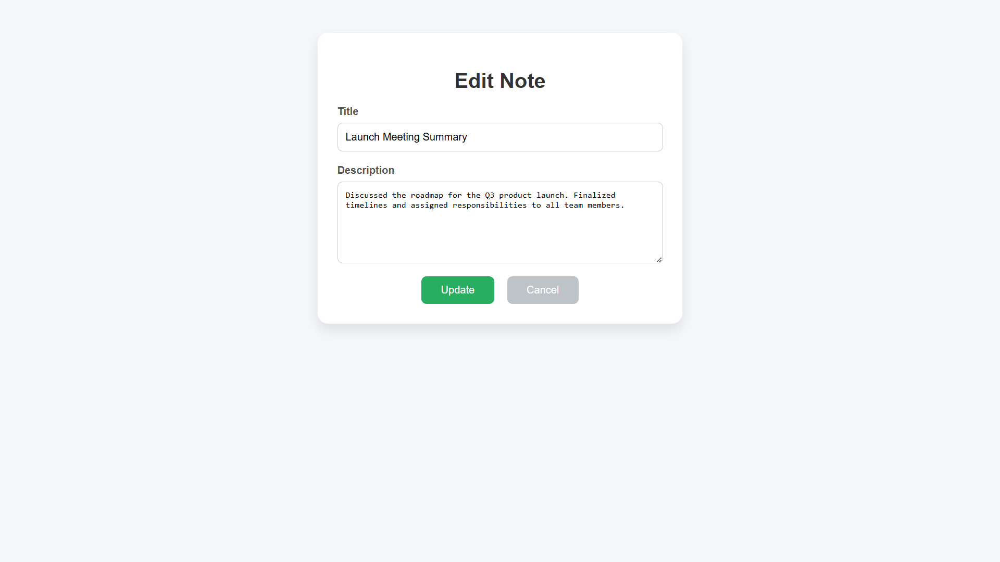

# 📝 Notes Management System

A full-stack Notes Management System built with **React**, **Node.js**, **Express**, and **MongoDB**. Users can create, view, edit, and delete their notes with a simple and clean UI. It supports full CRUD operations and uses form validation for better user experience.

---

## 🚀 Features

- Add, edit, delete, and view notes
- Simple, organized and clean user interface  
- Full CRUD operations  
- Real-time updates with MongoDB
- Form validation for note inputs
- RESTful API integration

---

## 🖼️ Screenshots

### 📋 Notes Dashboard

### ➕ Add Note Page

### ✏️ Edit Note Page

---

## 🛠️ Tech Stack

- **Frontend**: React.js  
- **Backend**: Node.js, Express.js  
- **Database**: MongoDB

---
